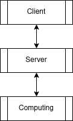

# The Collatz Conjecture on a Distributed Computing System

## What is the Collatz Conjecture?

The Collatz conjecture is a mathematical conjecture that states that after a sequence of operations on any natural number the sequence will always reach 1.

The operation to do on the number are as follows:

- if the number is **even**, divide the number by 2.
- if the number is **odd**, multiply the number by 3 and add 1.

This operation repeats until the number reaches 1, when the sequence is declared to be finished.

See: [Wikipedia](https://en.wikipedia.org/wiki/Collatz_conjecture)

## What is Distributed Computing or Distributed Systems?

A distributed system is a system that handles different parts of a process or program under multiple computers or threads.

See: [Wikipedia](https://en.wikipedia.org/wiki/Distributed_computing)

## Objective

The objective is to create a program that handles the following tasks:

- Calculate the numbers of the sequence starting with any number until it reaches 1.
  - Check that the number is not present in any of the other sequences.
  - On each iteration, check that the new number is not present in any of the existing sequences.
    - If it exists, join the existing sequence with the newly created sequence and finish processing the sequence.
- Separately, a client displays the sequences up to any depth in a graphical way.

## Design

The system should have three separate layers:

- Client, to display the sequences.
- Server or Storage, to display the store the sequences as they are found.
- Computing, in charge of finding new sequences.

### Client

The client should have a prompt asking the user to input a number that represents the depth of the sequences to show.

This layer only communicates with the Server.

### Server or Storage

This process stores the sequences. It should be a system that can receive multiple queries at once from multiple clients and the Computing layer (as it will have to validate every new number from sequences.)

### Computing

This layer is solely responsible for finding new sequences. After every new number found, it should validate that it doesn't already exists in the Server before continuing.

After a sequence has finished it should start with a new number.

This layer only communicates with the Server.

## Diagram

